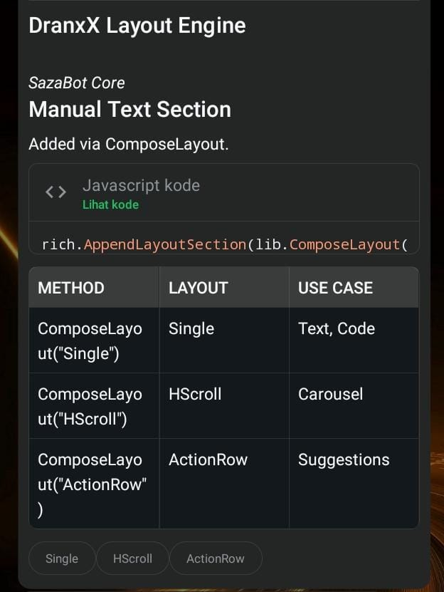

<p align="center">
  
</p>
<h1 align="center">Saza-Bot</h1>
<p align="center">
  Template bot WhatsApp Super fast berbasis <strong>Go + whatsmeow</strong> dengan sistem plugin, SQLite, rich response, dan reconnect otomatis.
  <br/>Tambah file <code>.go</code> ke <code>plugins/</code>, daftarkan lewat <code>init()</code>, lalu build ulang.
</p>

<p align="center">
  
  
  
  
  
</p>

---

[`English README`](README_ENG.md)

## Apa itu Saza-Bot?

**SAZA (Smart Assistant with Zero-delay Answer)** adalah bot WhatsApp lightweight dan super fast sebagai **starter/template**, bukan bot produksi siap pakai. Project ini menyediakan fondasi untuk membuat bot WhatsApp sendiri dengan:

- koneksi multi-device melalui [whatsmeow](https://github.com/tulir/whatsmeow);
- login QR atau pairing code;
- plugin Go yang mendaftar sendiri melalui `init()`;
- helper reply, edit, mention, reaction, delete, media, dan presence;
- AI Rich Response, native-flow button, selection list, dan carousel;
- session, banned user, dan premium user berbasis SQLite;
- resolusi identitas LID ↔ nomor telepon;
- cache metadata grup dan blocklist;
- proteksi spam multi-alias;
- reconnect otomatis dengan exponential backoff.

<table align="center">
  <tr>
    <td align="center">
      
      <br>
      <sub><b>⚡Super Fast Answer⚡</b></sub>
    </td>
    <td align="center">
      
      <br>
      <sub><b>Meta AI Style</b></sub>
    </td>
  </tr>
</table>


## Requirements

- **Go 1.25+**
- **git**
- Tidak membutuhkan `gcc` untuk konfigurasi bawaan karena memakai SQLite pure-Go (`modernc.org/sqlite`)

## Instalasi

```bash
git clone <repo-url> template-go
cd template-go
cp config.json.example config.json
nano config.json # edit phone number
go mod tidy
make run
```

Atau build binary:

```bash
make build
./template-go
```

Command Makefile:

| Command | Fungsi |
|---|---|
| `make run` | Menjalankan langsung dengan `go run .` |
| `make build` | `go mod tidy`, lalu build ke binary `template-go` |
| `make tidy` | Merapikan dan mengunduh dependency Go |
| `make reset-session` | Menghapus database session agar login ulang |
| `make clean` | Menghapus binary hasil build |

> `go run .` mengaktifkan watcher plugin eksperimental. Perubahan file plugin dikompilasi sebagai Go plugin pada platform yang mendukung `-buildmode=plugin`. Untuk hasil paling konsisten, restart `make run` atau build ulang setelah mengubah plugin.


## Dokumentasi

| Docs | Keterangan |
|---|---|
| [`docs/id/creating-plugins.md`](docs/id/creating-plugins.md) | Panduan plugin Go, referensi `Ctx`, helper pesan, target, premium, dan Before hook |
| [`docs/id/rich-messages.md`](docs/id/rich-messages.md) | AIRich, button/native flow, selection list, media header, dan carousel |
| [`docs/eng/creating-plugins.md`](docs/eng/creating-plugins.md) | English plugin development guide |
| [`docs/eng/rich-messages.md`](docs/eng/rich-messages.md) | English rich-message builder reference |

## Konfigurasi — `config.json`

Salin `config.json.example` menjadi `config.json`, lalu isi nomor dengan digit saja tanpa `+`, spasi, atau tanda baca.

```json
{
  "name": "Saza-Bot",
  "owner": "6289876543210",
  "bot": "6281234567890",
  "prefix": ".",
  "status": "public",
  "autoread": "enable",
  "loginMethod": "qr",
  "markdown": true
}
```

| Field | Tipe | Wajib | Keterangan |
|---|---|---:|---|
| `name` | string | Tidak | Nama bot. Default `Template Go`. |
| `owner` | string | Ya | Nomor owner untuk akses command owner. |
| `bot` | string | Disarankan | Nomor bot, terutama untuk pairing dan deteksi identitas. |
| `prefix` | string | Tidak | Prefix command. Default `.`. |
| `status` | string | Tidak | `public`, `ponly`, `gonly`, atau `self`. |
| `autoread` | string | Tidak | `enable` atau `disable`. |
| `loginMethod` | string | Tidak | `qr` atau `pairs`. |
| `markdown` | boolean | Tidak | Hint untuk plugin; WhatsApp mendukung markdown dasar secara native. |

Nilai config dinormalisasi ketika dimuat. Prefix kosong menjadi `.`, status tidak valid menjadi `public`, dan metode login tidak valid menjadi `qr`. Command `.set` dan `.setp` memperbarui sekaligus menyimpan `config.json`.

## Metode Login

### QR code

Atur `"loginMethod": "qr"`, jalankan bot, lalu buka:

**WhatsApp → Perangkat Tertaut → Tautkan Perangkat → scan QR terminal**

QR diperbarui sampai lima kali. Jika terus kedaluwarsa, session dibersihkan dan proses koneksi dimulai ulang.

### Pairing code

Atur `"loginMethod": "pairs"` dan isi `bot` atau `owner`. Bot meminta kode pairing untuk nomor tersebut. Jika keduanya kosong, nomor akan diminta melalui terminal.

Masukkan kode di **WhatsApp → Perangkat Tertaut → Tautkan Perangkat → Tautkan dengan nomor telepon**.

Session tersimpan di `db/session/template-session.db`. Untuk memaksa login ulang:

```bash
make reset-session
```

## Command Bawaan

| Command | Kategori | Keterangan |
|---|---|---|
| `.menu` / `.help` | info | Menampilkan command berdasarkan kategori |
| `.profile` | info | Menampilkan status premium dan kredit |
| `.msgbuild` / `.airich` | info | Demo rich response dan interactive message |
| `.hello` / `.hi` | info | Contoh plugin Go |
| `.ping` / `.stats` / `.status` | utility | Latency, CPU, RAM, platform, dan uptime |
| `$ <command>` | owner | Menjalankan shell command dengan timeout 30 detik |
| `.set <mode>` | owner | Mengubah `public`, `ponly`, `gonly`, atau `self` |
| `.setp <prefix>` / `.setprefix` | owner | Mengubah prefix dan menyimpan config |
| `.ban <target> [durasi]` | owner | Ban permanen atau sementara |
| `.unban <target>` | owner | Menghapus ban |
| `.listban` / `.banlist` | owner | Daftar banned user |
| `.addprem <target> [durasi]` | owner | Menambah atau memperbarui premium |
| `.delprem <target>` | owner | Menghapus premium |
| `.listprem` | owner | Daftar premium dan kredit |

Durasi mendukung gabungan `s`, `m`, `h`, dan `d`, misalnya `30m`, `12h`, atau `1d12h`. Tanpa durasi berarti permanen.

Target user dapat diberikan melalui:

1. reply pesan target;
2. mention `@user`;
3. nomor langsung, misalnya `.ban 6281234567890 1h`;
4. pada chat pribadi, target default adalah lawan chat jika tidak ada target eksplisit.

## Membuat Plugin Singkat

```go
// plugins/info-hello.go
package plugins

import "context"

func init() {
    Register(&Plugin{
        Command:     []string{"hello", "hi"},
        Description: "Send a greeting",
        Category:    "info",
        Handler: func(_ context.Context, c *Ctx) error {
            return c.Replyf("Hello %s!", c.PushName)
        },
    })
}
```

Simpan file, lalu restart `make run` atau build ulang. Plugin berada dalam package `plugins`, jadi dapat langsung memakai `Plugin`, `Ctx`, `Register`, dan helper package tersebut.

Kategori umum: `ai`, `info`, `utility`, `downloader`, `owner`, dan `hidden`. Plugin `hidden` tidak muncul di menu dan biasanya memakai `Before` hook.

## Rich Message Singkat

```go
import "template-go/lib"

return lib.NewComposer(c.Client).
    WithHeader("Hasil Pencarian").
    AppendText("Berikut hasil untuk *Saza-Bot*.").
    AppendCode("go", "fmt.Println(\"hello\")").
    AppendTable([][]string{
        {"File", "Fungsi"},
        {"main.go", "Entry point"},
    }).
    AppendSuggestedPills([]string{"Menu", "Profile"}).
    DispatchMessage(ctx, c.Chat, c.Event)
```

Builder lain yang tersedia:

- `lib.NewActionComposer(...)` — quick reply, URL, copy, dan single-select;
- `lib.NewSimpleFlow(...)` — kartu tombol ringkas;
- `lib.NewCarouselComposer(...)` — carousel dari beberapa interactive card.

## Format Log

| Tag | Isi |
|---|---|
| `[msg]` | Pesan teks |
| `[img]` / `[vid]` / `[doc]` | Media dengan caption |
| `[audio]` | Audio/voice note; tanpa teks tidak menjadi command |
| `[self]` | Pesan dari device bot |
| `[command]` | Command yang ditemukan dan dieksekusi |
| `[PLUGIN ERROR]` | Handler mengembalikan error |
| `[SESSION]` | Login, koneksi, disconnect, dan reconnect |
| `[CACHE]` | Invalidasi metadata grup |

Reaction, sticker, dan protocol message dilewati sebelum dispatch command.

## Penyimpanan

```text
db/
├── session/template-session.db
├── banned/banned.db
└── premium/premium.db
```

Semua database menggunakan SQLite dengan WAL, `synchronous=NORMAL`, dan `busy_timeout=5000`. File runtime di bawah `db/` diabaikan Git.

### Ban

Ban dicocokkan menggunakan nomor telepon dan LID. Entri kedaluwarsa dibersihkan secara lazy ketika store diakses. Proteksi spam memakai identitas nomor, LID, dan JID yang menunjuk state penghitung sama agar tidak mudah dilewati.

Aturan spam command:

- maksimal 3 command berturut-turut dengan jeda kurang dari 2 detik;
- command ke-4 mendapat peringatan;
- command ke-5 menghasilkan temporary ban 5 menit;
- penghitung di-reset setelah jeda dan state lama dibersihkan berkala.

### Premium

Premium memiliki **10 kredit per bulan**. Kredit di-reset secara lazy saat profil pertama kali dibaca pada periode kalender baru. Store juga menyediakan fungsi untuk consume, set, tambah, dan kurangi kredit.

## Arsitektur

### Startup dan koneksi

```text
main()
  ├── config.Load("config.json")
  ├── init SQLite session, banned, premium
  ├── connectToWhatsApp()
  │     ├── buka sqlstore whatsmeow
  │     ├── login QR/pairing jika device belum terdaftar
  │     └── client.Connect() jika session sudah ada
  └── eventHandler
        ├── Connected      → reset backoff, resolve owner, warm cache
        ├── Disconnected   → jadwalkan reconnect
        ├── StreamReplaced → disconnect koneksi lama, reconnect 10 detik
        ├── LoggedOut      → hapus session, login ulang
        ├── Message        → handler.Handle()
        ├── GroupInfo      → invalidasi cache grup
        └── CallOffer      → tolak panggilan dan kirim pemberitahuan
```

### Pipeline pesan

```text
Message event
  ├── abaikan pesan lama (>60 detik), broadcast, protocol
  ├── unwrap ephemeral / view-once / document-with-caption
  ├── ekstrak text, type, quote, mention, sender
  ├── resolve LID → phone
  ├── cek blocklist untuk pesan grup
  ├── ambil metadata grup (cache 5 menit, stale-while-refresh)
  ├── hitung owner dan status admin grup
  ├── filter mode public / ponly / gonly / self
  ├── jalankan semua Before hook
  ├── parse prefix atau "$ "
  ├── normalisasi command Unicode NFD
  ├── lookup plugin → ban → spam → autoread
  └── plugin.Handler(context.Background(), c)
```

## Struktur Direktori

```text
template-go/
├── main.go                    # Startup, session, event loop, reconnect
├── Makefile
├── go.mod
├── config.json.example
├── config/
│   └── config.go              # Config thread-safe + persistence
├── handler/
│   └── handler.go             # Pipeline pesan, cache, spam protection
├── plugins/
│   ├── registry.go            # Registry plugin thread-safe
│   ├── ctx.go                 # Context, parser, dan helper pesan/media
│   ├── demo-hello.go
│   ├── info-*.go
│   ├── utility-*.go
│   ├── owner-*.go
│   └── hidden-*.go
├── lib/
│   ├── airich.go              # AIRich, native flow, carousel builders
│   └── airich_test.go
├── store/
│   ├── banned.go              # SQLite banned store
│   ├── premium.go             # SQLite premium + credit store
│   └── owner.go               # Cache identitas LID ↔ phone
├── docs/
│   ├── id/
│   └── eng/
└── db/                        # Dibuat otomatis; tidak masuk Git
```

## Catatan Kompatibilitas

- Project bergantung pada versi pseudo `whatsmeow` yang tercantum di `go.mod`.
- Interactive/rich message memakai protobuf dan node internal WhatsApp. Dukungan dapat berubah mengikuti versi WhatsApp/whatsmeow.
- Watcher plugin runtime memakai Go `plugin`, yang umumnya tersedia di Linux/macOS dan tidak didukung native di Windows. Build/restart biasa tetap portabel selama dependency mendukung platform tersebut.
- Statistik server `.ping` membaca `/proc`, sehingga nilai CPU/RAM server paling lengkap di Linux.


## Lisensi dan Kredit

MIT — bebas digunakan untuk kebutuhan pribadi dan komersial. Base dibuat oleh **[@DranxX](https://github.com/DranXX)**.

Didukung oleh [whatsmeow](https://github.com/tulir/whatsmeow) dan SQLite pure-Go melalui [`modernc.org/sqlite`](https://pkg.go.dev/modernc.org/sqlite).
